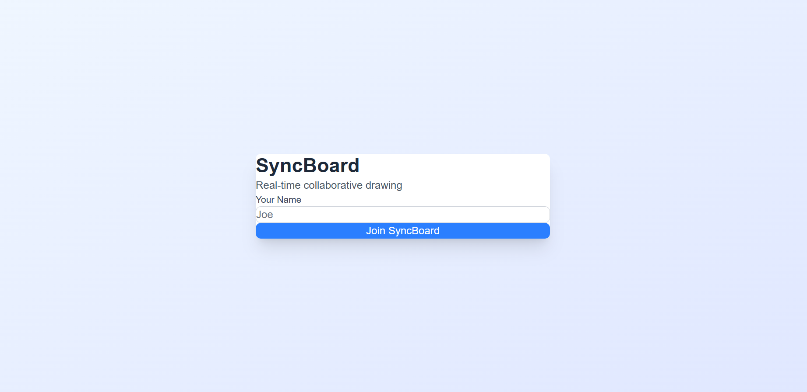
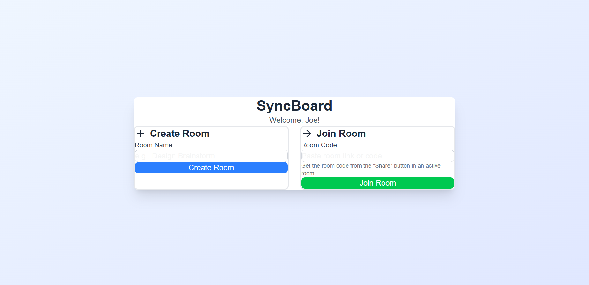
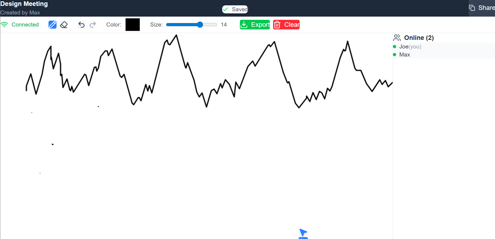
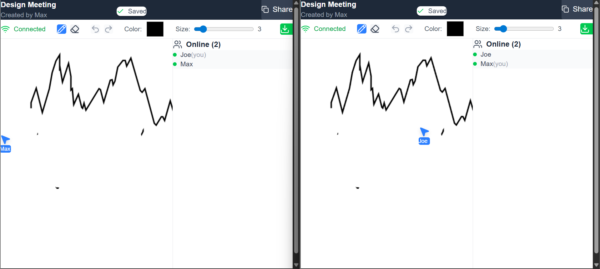

# 🎨 SyncBoard

A real-time collaborative whiteboard built with Next.js, Socket.io, and PostgreSQL.

🔗 **Live Demo:** [View Project Here](https://sync-boardfrontend.vercel.app/)

> **Note:** This project runs on a free/hobby backend. Initial requests may experience a short delay (cold start). Please wait a few seconds or refresh if needed.

## ✨ Features

- **Real-time Collaboration** - Multiple users can draw simultaneously with sub-100ms latency
- **Room-Based Sessions** - Create private rooms with shareable URLs
- **Drawing Tools** - Pen, eraser, color picker, adjustable brush sizes
- **Undo/Redo** - Full command history with keyboard shortcuts (Ctrl+Z/Y)
- **User Presence** - See who's online and view their cursors in real-time
- **Auto-Save** - Canvas automatically persists to PostgreSQL
- **Export** - Download your whiteboard as PNG or SVG
- **Performance Optimized** - Throttled emissions (40% network reduction), debounced saves

## 🛠️ Tech Stack

### Frontend

- **Next.js 16** (App Router)
- **TypeScript**
- **Tailwind CSS**
- **Zustand** (State Management)
- **Socket.io Client**
- **Canvas API**

### Backend

- **Node.js / Express**
- **Socket.io Server**
- **Prisma ORM**
- **PostgreSQL** (Neon)

## Screenshots

### Lobby Screen


_Login screen to enter your name._

### Create/Join Room


_Create a new room or join an existing one._

### Whiteboard Interface


_Real-time collaborative whiteboard with drawing tools._

### Collaboration in Action


_Multiple users drawing together in real-time._

## 🚀 Getting Started

### Prerequisites

- Node.js 18+
- PostgreSQL database (or Neon account)

### Installation

1. **Clone the repository**

```bash
git clone https://github.com/RohanMishra47/SyncBoard.git
cd SyncBoard
```

2. **Install server dependencies**

```bash
cd server
npm install
```

3. **Set up environment variables**

```bash
# server/.env
DATABASE_URL="your_postgresql_connection_string"
PORT=4000
CLIENT_URL="http://localhost:3000"
```

4. **Run database migrations**

```bash
npx prisma migrate dev
```

5. **Install client dependencies**

```bash
cd ../client
npm install
```

6. **Set up client environment variables**

```bash
# client/.env.local
NEXT_PUBLIC_API_URL=http://localhost:4000
```

7. **Start the development servers**

Terminal 1 (Server):

```bash
cd server
npm run dev
```

Terminal 2 (Client):

```bash
cd client
npm run dev
```

8. **Open the app**
   Navigate to `http://localhost:3000`

## 📖 Usage

1. Enter your name to join
2. Create a new room or join an existing one
3. Share the room URL with teammates
4. Start drawing together in real-time!

### Keyboard Shortcuts

- `P` - Pen tool
- `E` - Eraser tool
- `Ctrl+Z` - Undo
- `Ctrl+Y` or `Ctrl+Shift+Z` - Redo

## 🏗️ Architecture Decisions

### Why Socket.io over WebRTC?

Socket.io provides simpler server-mediated synchronization, easier debugging, and better reliability for drawing data (which doesn't require peer-to-peer connections).

### Why Zustand over Redux?

Zustand offers a minimal API, no boilerplate, and excellent TypeScript support. For this project's scope, Redux would be over-engineering.

### Performance Optimizations

- **Throttling**: Limited socket emissions to 60fps (16ms intervals)
- **Debouncing**: Auto-save triggers 3s after last action
- **Action Limits**: Canvas history capped at 1000 actions
- **Selective Rendering**: Only re-render components when their subscribed state changes

## 📊 Performance Metrics

- **Network Traffic**: 40% reduction through throttling
- **Save Operations**: 90% reduction through debouncing
- **FPS**: Maintained 60fps with 5+ concurrent users
- **Latency**: Sub-100ms drawing synchronization

## 🚧 Future Enhancements

- [ ] Shape tools (rectangle, circle, line)
- [ ] Text annotations
- [ ] Image uploads
- [ ] Session recording/playback
- [ ] Touch gestures (pinch to zoom)
- [ ] Dark mode

## 📝 License

MIT

## 👤 Author

**Rohan Mishra**

- 💼 LinkedIn: [Rohan Mishra](https://www.linkedin.com/in/rohan-mishra-6391bb372/)
- 🐙 GitHub: [RohanMishra47](https://github.com/RohanMishra47)
- 𝕏 (Twitter): [@RohanMishr19102](https://x.com/RohanMishr19102)
- 📧 Email: mydearluffy093@gmail.com

---

Built as a portfolio project to demonstrate full-stack real-time web development skills.

## ❤️ Thank You!
